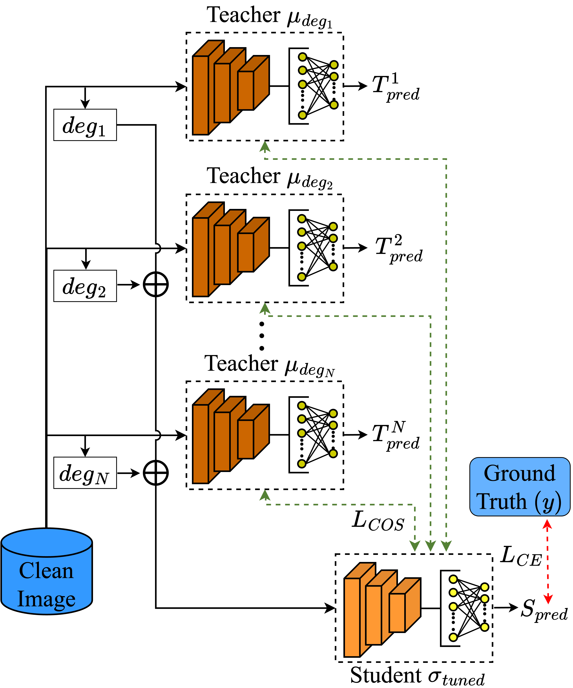

# Consolidating separate degradations model via weights fusion and distillation

Authors: [Dinesh Daultani](https://dineshdaultani.github.io/), [Hugo Larochelle](https://mila.quebec/en/person/hugo-larochelle/)

[[paper](https://openaccess.thecvf.com/content/WACV2024W/VAQ/papers/Daultani_Consolidating_Separate_Degradations_Model_via_Weights_Fusion_and_Distillation_WACVW_2024_paper.pdf)]

This repository contains the source code associated with the paper "Consolidating separate degradations model via weights fusion and distillation", which was presented at WACV 2024 workshop.

## Abstract
Real-world images prevalently contain different varieties of degradation, such as motion blur and luminance noise. Computer vision recognition models trained on clean images perform poorly on degraded images. Previously, several works have explored how to perform image classification of degraded images while training a single model for each degradation. Nevertheless, it becomes challenging to host several degradation models for each degradation on limited hardware applications and to estimate degradation parameters correctly at the run-time. This work proposes a method for effectively combining several models trained separately on different degradations into a single model to classify images with different types of degradations. Our proposed method is four-fold: (1) train a base model on clean images, (2) fine-tune the base model individually for all given image degradations, (3) perform a fusion of weights given the fine-tuned models for individual degradations, (4) perform fine-tuning on given task using distillation and cross-entropy loss. Our proposed method can outperform previous state-of-the-art methods of pretraining in out-of-distribution generalization based on degradations such as JPEG compression, salt-and-pepper noise, Gaussian blur, and additive white Gaussian noise by 2.5% on CIFAR-100 dataset and by 1.3% on CIFAR-10 dataset. Moreover, our proposed method can handle degradation used for training without any explicit information about degradation at the inference time. 

## Brief Introduction
Computer vision has been widely used in real-world applications nowadays. Considerable research has focused on the assumption that the images do not contain abnormalities and only ideal images. Real-world images frequently have different perturbations, like motion blur, noise (caused by low-light conditions), and compression, appearing in various digital versions of images/videos. Specifically, some computer vision domains face challenges with image degradation, leading to diminishing model performance or reliability. Hence, degradation in vision is often unavoidable, so it is crucial to handle degraded images properly. At the same time, often, the models trained are specific for a particular degradation. However, our study focuses on an essential aspect of this limitation: combining several models trained separately on individual degradations. To the best of our knowledge, this study is the first to investigate the method of combining separately trained degradation models into a single model for the classification of images with distinct types of degradation.

Our proposed method is split into four steps as follows: 
1. Train a base model $\mu_{clean}$ on clean images.
2. Fine-tune the base model $\mu_{clean}$ individually for each degradation $deg$, i.e., $\mu_{deg}$.
3. Perform fusion of weights given the fine-tuned models $\mu_{deg}$ for individual degradations as $\sigma$.
4. Perform fine-tuning on all degradation images using distillation and cross-entropy loss as $\sigma_{tuned}$.

<p align="center">
  
  
  <em>Figure 1. Fine-tuning of Student $\sigma_{tuned}$ using fusion model initialized with weights $\sigma$ and knowledge transfer from Teachers $\mu_{deg_{1}}$, $\mu_{deg_{2}}$, ..., $\mu_{deg_{N}}$ where $N$ represents total individual degradations used for consolidation in the student network.</em>
</p>


## Quantitative evaluation results

Performance evaluation for comparison approaches, applied to different datasets on ResNet56 backbones. These datasets undergo assessment under four distinct degradations, i.e., JPEG compression, Gaussian blur, additive white Gaussian noise, and salt-and-pepper noise, denoted as JPEG, Blur, AWGN, and SAPN, respectively. The "Avg" column contains the average for the above four degradations. Moreover, results in **bold** and <ins>underline</ins> represent the best performance for combined degradation and separate/combined models, respectively.

### CIFAR-100 dataset
| Approach                  | JPEG | Blur | AWGN | SAPN | Avg  |
|:-------------------------:|:----:|:----:|:----:|:----:|:----:|
| Base separate (Oracle)    | 63.4 | 58.2 | 65.4 | <ins>74.1</ins> | 65.3 |
| Ensemble                  | 59.3 | 25.3 | 43.6 | 58.7 | 46.7 |
| Scratch                   | 59.1 | 54.3 | 61.0 | 66.0 | 60.1 |
| Vanilla fine-tuning       | 62.2 | 56.0 | 63.8 | 70.2 | 63.1 |
| ModelSoups                | 1.1  | 1.0  | 1.2  | 1.0  | 1.1  |
| Fusing                    | 62.3 | 56.4 | 64.1 | 70.5 | 63.3 |
| FusionDistill (Ours)      | <ins>**64.5**</ins> | <ins>**58.6**</ins> | <ins>**66.4**</ins> | **73.7** | <ins>**65.8**</ins> |

### Tiny Imagenet dataset
| Approach                  | JPEG | Blur | AWGN | SAPN | Avg  |
|:-------------------------:|:----:|:----:|:----:|:----:|:----:|
| Base separate (Oracle)    | 56.3 | <ins>50.3</ins> | 57.7 | 60.6 | 56.2 |
| Ensemble                  | 53.1 | 17.4 | 45.4 | 49.9 | 35.5 |
| Scratch                   | 54.0 | 48.2 | 55.3 | 58.2 | 53.9 |
| Vanilla fine-tuning       | 55.2 | 48.1 | 56.6 | 59.7 | 54.9 |
| ModelSoups                | 0.5  | 0.5  | 0.5  | 0.5  | 0.5  |
| Fusing                    | 54.2 | 47.1 | 55.2 | 58.8 | 53.8 |
| FusionDistill (Ours)      | <ins>**56.7**</ins> | **48.5** | <ins>**58.2**</ins> | <ins>**61.9**</ins> | <ins>**56.3**</ins> |

For more details of our proposed method and relevant details please refer to our [paper](https://openaccess.thecvf.com/content/WACV2024W/VAQ/papers/Daultani_Consolidating_Separate_Degradations_Model_via_Weights_Fusion_and_Distillation_WACVW_2024_paper.pdf).

## Requirements
To install all the pre-requisite libraries install the docker container from `docker/Dockerfile`. Following python libraries are main pre-requisites:  
* pytorch==1.12.0
* imagedegrade

To properly reproduce the results from the paper, please use the provided docker `Dockerfile` and `docker/requirements.txt`. Sample docker build and run commands are as follows:
* `docker build -f docker/Dockerfile -t pytorch_1.12 .`
* `docker run -v /:/data --shm-size 50G -p 8008:8008 -it --gpus '"device=0,1"' pytorch_1.12 /bin/bash`

## Training / Evaluation
### Proposed method
Proposed method training is done in four steps:  
1. Step-1: Train a base model on clean images.
    - Training: 
      ```
      python train.py -c configs/ind/<DATASET>/ResNet56_clean.yaml
      ```  
    By default the clean image models reside in `saved/jpeg/IndTrainer` directory. 

2. Step-2: Fine-tune the base model trained on clean images for each degradation individually.
    - Training: 
      ```
      python train.py -c configs/sl/<DATASET>/ResNet56-56.yaml --dt <DEG_TYPE>
      ```
    
3. Step-3: Perform fusion of weights given the fine-tuned models for individual degradations    
    - Fusion (ModelSoups):
      ```
      python utils/model_soups.py --dataset <DATASET>
      ```

      We need to specify the dataset and it will by default read the ResNet config file for model soups in the specific dataset folder. 

4. Step-4: Perform fine-tuning on all degradation images using distillation and cross-entropy loss
    - Training: 
      ```
      python train_all_deg.py -c configs/deg_all/<DATASET>/ResNet56-56_consistency.yaml --dt combined_deg
      ```  
    - Evaluation: 
      ```
      python test.py -r saved/combined_deg/SLDA_Trainer/ResNet56-56_CIFAR10/train/<EXP_STRING>/model_best.pth --dt <DEG_TYPE>
      ```

Please refer to the notes at the end for some common details to run the experiments. 

### Running existing method experiments (Baselines)
#### Base separate (Oracle)
  Oracle method is nothing but the Step-2 models trained on degradation individually. Hence, we need to run evaluation after Step-2:
  - Evaluation: 
    ```
    python test.py -r saved/<DEG_TYPE>/SLTrainer/ResNet56-56_<DATASET>/train/<EXP_STR>/model_best.pth
    ```

#### Ensemble 
  This method uses combination of all individually trained degradation models. Hence, we need to only run the evaluation out-of-the-box using separately prepared ensemble script:
  - Evaluation: 
    ```
    python test_ensemble.py -c configs/deg_all/<DATASET>/ResNet56_ensemble.yaml
    ```

#### Scratch
  - Training: 
    ```
    python train_all_deg.py -c configs/deg_all/<DATASET>/ResNet56_base_scratch.yaml --dt combined_deg
    ```
  - Evaluation: 
    ```
    python test.py -r saved/combined_deg/IndDATrainer/ResNet56_<DATASET>_deg_scratch/train/<EXP_STRING>/model_best.pth --dt <DEG_TYPE>
    ```

#### Vanilla Finetuning
  - Training: 
    ```
    python train_all_deg.py -c configs/deg_all/<DATASET>/ResNet56_base_vanilla.yaml --dt combined_deg
    ```
  - Evaluation: 
    ```
    python test.py -r saved/combined_deg/IndDATrainer/ResNet56_<DATASET>_deg_vanilla/train/<EXP_STRING>/model_best.pth --dt <DEG_TYPE>
    ```

#### ModelSoups
  ModelSoups method doesn't involve any training and running evaluation is after the Step-3 of the proposed method, i.e., the weight fusion process.  
  - Evaluation: 
    ```
    python test.py -r saved/combined_deg/SLTrainer/ResNet56-56_<DATASET>_soups/train/<EXP_STRING>/model_best.pth --dt <DEG_TYPE>
    ```

#### Fusing
  - Training: 
    ```
    python train_all_deg.py -c configs/deg_all/<DATASET>/ResNet56_fused.yaml --dt combined_deg
    ```
  - Evaluation: 
    ```
    python test.py -r saved/combined_deg/IndDATrainer/ResNet56_<DATASET>_deg_fused/train/<EXP_STRING>/model_best.pth --dt <DEG_TYPE>
    ```

### Notes for running experiments:
- Replace <DATASET> with either "CIFAR10", "CIFAR100" or "TinyImagenet" to run the experiments for specific dataset for training or evaluation scripts. 
- Replace <DEG_TYPE> with degradations such as `jpeg`, `blur`, `noise`, `saltpepper` when training for individual degradation, i.e., Step-2. Consequently, replace <DEG_TYPE> with `combined_deg` when training for all degradations, i.e., Step-4.
- If you train the model from scratch you need to change `pretrained_path` paths in config yaml files. 
- Replace <EXP_STR> with appropriate run id after running the training. 
- Evaluation script is run for specific degradation.

## Citation
If you find our work or this repository helpful, please consider citing our work:

```bibtex
@InProceedings{Daultani_2024_WACV,
    author    = {Daultani, Dinesh and Larochelle, Hugo},
    title     = {Consolidating Separate Degradations Model via Weights Fusion and Distillation},
    booktitle = {Proceedings of the IEEE/CVF Winter Conference on Applications of Computer Vision (WACV) Workshops},
    month     = {January},
    year      = {2024},
    pages     = {440-449}
}
```